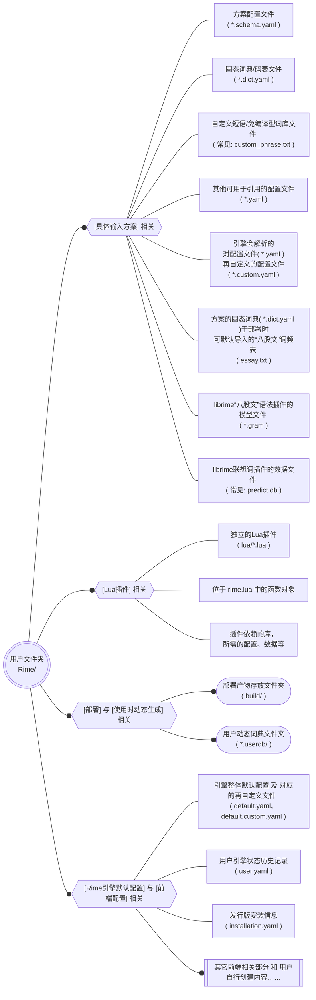

# 安装与使用Rime

> 本节算是实操环节，不过为了安装和使用Rime，我们首先需要来了解下Rime配置的相关概念。

## 开始之前

#### Rime配置是什么

Rime的程序与数据是分离的。在你下载安装完Rime输入法软件后，发行版并非一定有自带一套默认配置，所以你可以（并且也大概需要）自己准备Rime配置。#todo 分离程序与数据有诸多好处，方便重置等

Rime的配置放在通常称为“用户文件夹”的路径下，且一般此文件夹名称为`Rime`，Rime配置的形式为若干松散文件及文件夹，内容上可以分为具体输入方案相关配置、Lua插件、Rime核心配置与Rime前端配置相关。其中具体输入方案相关配置通常可以分为 输入方案配置文件(`*.schema.yaml`) 和 词典文件(`*.dict.yaml`)。

下面是一幅示意图，尽可能分类列出了Rime用户配置文件夹中可能出现的文件及其用途：

#todo !! 放个实际的Rime用户文件夹的截图

#### 获取一套Rime配置

获取他人制作的输入法方案可以尝试这些途径：

- 在各种方案群的群文件中下载
- 在GitHub或各种平台上寻找公开的配置
- 直接联系方案设计者尝试索取

除了获取公开的方案，如果你对发行版自带的方案满意，你也可以直接使用自带方案，并在其基础上修改定制。

下面将使用雾凇拼音作为示例，来给Rime安装一个输入法方案（即置入该方案的Rime配置至用户配置文件夹）

#todo （如何从Github上下载方案，截图指引，登云梯与科学与镜像站）

> 后面是一些在各平台上安装与部署Rime的具体步骤演示，可以跳过不会使用到的版本的内容，如果你已经会安装了，那么就可以直接跳过本节内容了。

## 1、在 Windows 10 上使用Rime

#### 安装小狼毫

从官网下载小狼毫的安装包，然后按照一般的软件安装步骤一路下一步完成安装。此时，开始菜单中会出现小狼毫的若干执行快捷方式

#todo 选择你要安装的小狼毫来源版本：水龙月版与官版；及其间的异同

#todo （安装完成效果）

#todo 安装、重装、卸载小狼毫注意事项与原因

## 2、在 Linux发行版 上使用Rime

#TODO 介绍Linux上输入法框架存在原因、介绍两种输入法框架iBus与fcitx5与Rime、安装方式

## 3、在 Android 及 各种衍生系统 上使用Rime

#TODO 同文、中文与 f5a，额外的软键盘配置