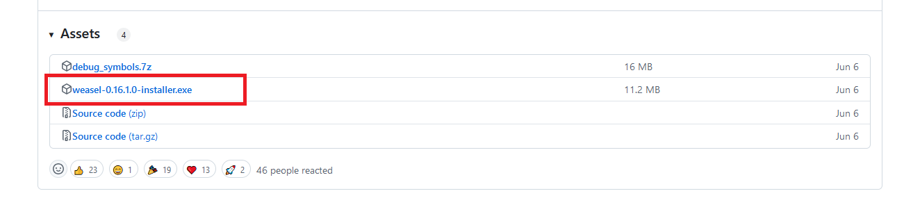
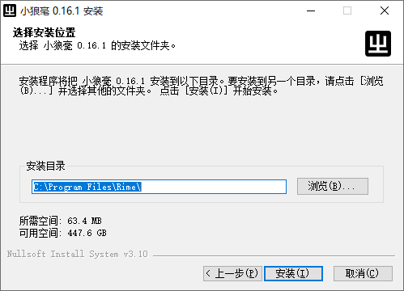
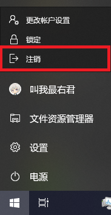
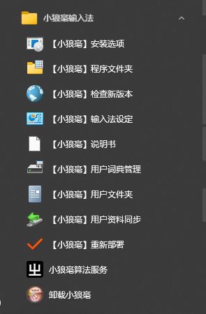
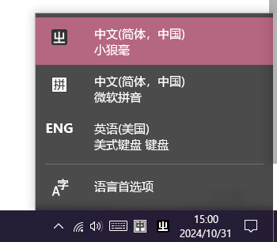
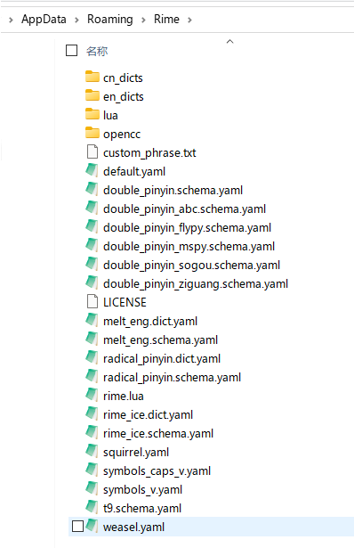

# 安装与使用Rime

> 下面将以雾凇拼音作为目标方案，展示*如何在Win10上安装Rime* 并*配置一个输入方案使用* .

#todo （如何从Github上下载方案，截图指引，登云梯与科学与镜像站）

## 1、在 Windows 10 系统上使用Rime

### 1. 安装小狼毫

> 如果已有安装小狼毫，请务必！先**备份用户数据**，然后卸载小狼毫，并重启；然后再安装不同版本的小狼毫！否则可能会出现丢失输入数据、系统输入法框架错误等问题.
>
> （关于如何备份数据和配置文件，请跳到后面查看）

1. 点击[Rime主页](https://rime.im/)上的下载链接，或前往小狼毫在GitHub上的项目[Releases页面](https://github.com/rime/weasel/releases/latest)，向下滚动页面找到“Assets”处，点击即可下载小狼毫安装包；
    

  > 如果遇到无法访问、无法下载、网络连接超时、下载速度慢、下载过程不稳定易中断 等问题，可查看GitHub访问加速相关文章.

2. 找到下载的安装程序，双击运行；确认授予管理员权限；
3. 点击下一步和安装；其中安装目录建议可以保持默认；
    
4. 安装完成；
5. 重启电脑，或至少注销再登录；点击开始菜单中的头像可以看到注销功能；
（在注销之前，请保存已打开的文件，关闭所有工作的窗口，确保不会丢失数据）

安装完成之后应该能观察到如下图所示效果：

可以看到开始菜单中出现了很多功能的快捷方式，包括打开配置文件所在的“用户文件夹”、“重新部署”、“卸载小狼毫” 等功能；

也可以看到任务栏中的输入法选单中出现了小狼毫的选项；

如果输入法选单中没有出现小狼毫，则可以进入“语言首选项”-选中“中文”语言-“选项”-“添加键盘”，在其中选中小狼毫即可；

（若选项中没有出现小狼毫，则考虑是否有完成正确安装，可以尝试完全卸载后再重新安装，注意备份数据)

> 为什么前面反复提到小狼毫要卸载干净后才能重装，最好不要直接覆盖安装，升级前最好备份下数据？
> 因为软件的升级与系统对接和版本配置文件过渡与转换非常麻烦费事，且变数意外极多的情况，包括对输入法注册与添加、软件安装信息与卸载注册等等，另外也有第三方维护的小狼毫版本，情况过于复杂过于难以处理；所以小狼毫选择不在这些方面做过多处理，只保证小狼毫在清洁安装的情况下会更有把握安装成功；另外，也有极小概率发生由升级造成的数据和配置或词库丢失的意外——总之十分不建议冒这个险.

### 2. 替换默认方案

> 小狼毫自带了几套输入方案，但是可能有些不适合简中用户使用，功能也不够全面，比如词库是繁体转换成的简体、没有双拼功能等，因此我们可以直接使用别人做好的更完善的用户自制的方案配置，例如[雾淞拼音](https://dvel.me/posts/rime-ice/)、[白霜拼音](https://github.com/gaboolic/rime-frost)、[薄荷拼音](https://www.mintimate.cc/zh/)、[四叶草拼音](https://www.fkxxyz.com/d/cloverpinyin/)、等；
>
> 由于我们刚接触Rime，不可能一上来就掌握复杂的配置功能，因此我们只要能先用上，能顺手打出字就足够了，上述四种方案都能满足我们的需求，本教程使用雾淞拼音，你也可以一同参考雾淞拼音的安装说明；对于后两者，你也可以参看 他们各自的步骤教程说明：白霜拼音[手动下载安装](https://github.com/gaboolic/rime-frost?tab=readme-ov-file#%E6%89%8B%E5%8A%A8%E4%B8%8B%E8%BD%BD%E5%AE%89%E8%A3%85)说明、[薄荷拼音 - 配置教程](https://www.mintimate.cc/zh/guide/)、[四叶草拼音 - 安装说明](https://github.com/fkxxyz/rime-cloverpinyin/wiki)，在“安装”(置入方案文件)这个阶段操作都是相通的；

> 如遇 无法访问、无法下载、网络连接超时、下载速度慢、下载多次失败 等问题，可查看GitHub访问加速相关文章.

#### 1) 下载雾淞拼音配置

打开雾淞拼音GitHub项目的[Releases页面](https://github.com/iDvel/rime-ice/releases)，找到最新的版本，选择 `full.zip` 下载

#### 2) 清除自带方案

> 注意，如果你还有以前使用时积累的用户数据没有备份，请先备份再操作！一种简单的备份是把整个文件夹复制到桌面，或者随便什么安全的地方

首先打开用户文件夹：在开始菜单中，找到小狼毫输入法的文件夹，点击“打开 用户文件夹”，这样就打开了我们方案所在的用户配置目录了；也可以右键任务栏中的输入法托盘区的小狼毫的图标 “中” 字，然后在其中找“用户文件夹”的选项打开用户配置目录；

然后在输入法托盘区，右键小狼毫 “中” 字图标，点击“退出算法服务”，因为算法服务会锁定文件无法操作，退出后我们才能保证清空自带方案文件；

切换回用户文件夹窗口，全选，然后删除所有文件；顺利删除完成后，应该整个文件夹就彻底空了；这样我们就清除了发行版自带的配置方案了；

> 发行版的自带的方案并没有被彻底删除，此处删除的是软件安装过程中安装器自动从程序目录中复制到用户文件夹的副本；若你需要，你可以之后再恢复出发行版自带的默认方案；

#### 3) 置入我们所选方案的配置

Rime的配置文件是一个文件夹下的一堆松散文件，因一个文件夹极为不便于在网络上传播，故我们一般将整个Rime配置文件夹打包成一个压缩包文件；当我们需要使用时，只需要将这个压缩包里的松散文件解压至Rime的配置文件夹“用户文件夹”，就可以恢复还原为方案作者的状态，也就实现了“导入”方案、“安装”方案配置 的效果；（也因此，Rime某种程度上来说，同时只能使用一套配置，多套配置只能存放在其他地方，按需切换使用）（注意**整套配置**与**具体输入方案**的概念区别，一套配置中可以有多个具体的输入法方案；所有的松散文件整体我们合称为一套配置）

（在解压的时候注意压缩包中文件夹的层级关系，应让松散文件直接解压至“用户文件夹”中，避免出现文件夹里又有一层文件夹的套娃情况）

正确放置后，效果应该如下图所示：

#### 4) 勾选要启用的方案

